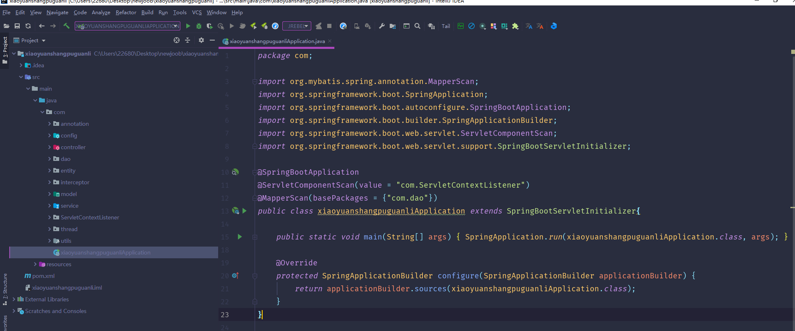
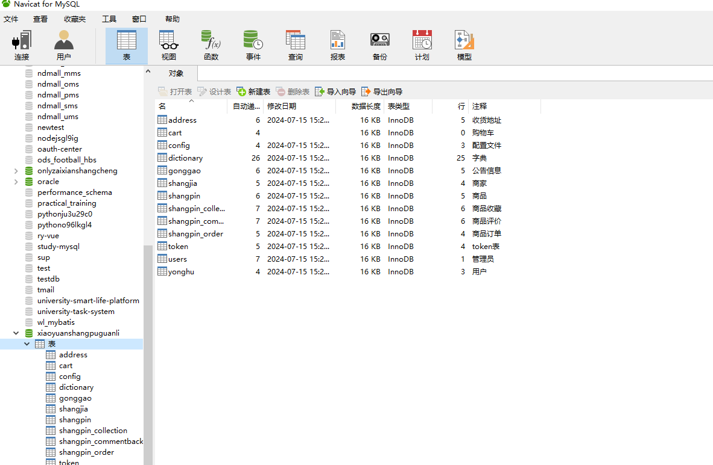
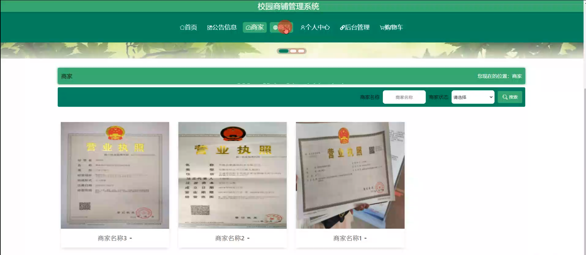
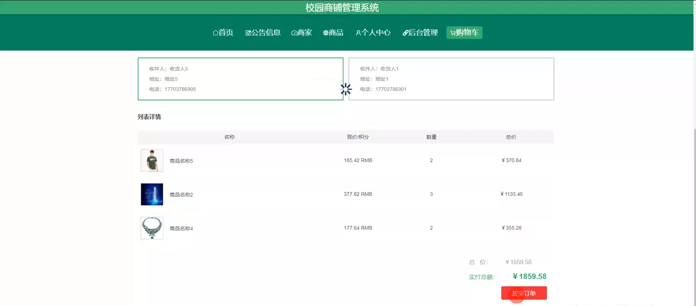
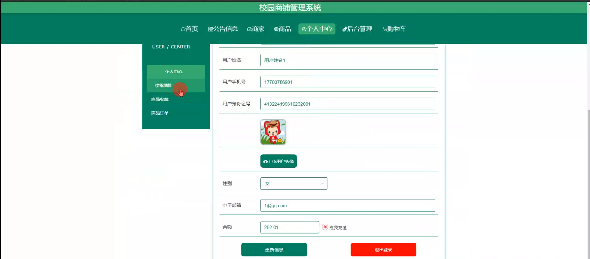
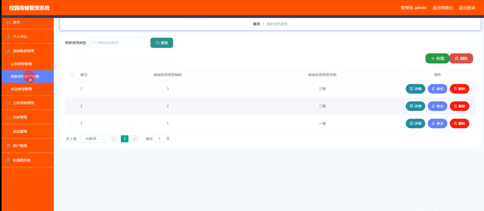
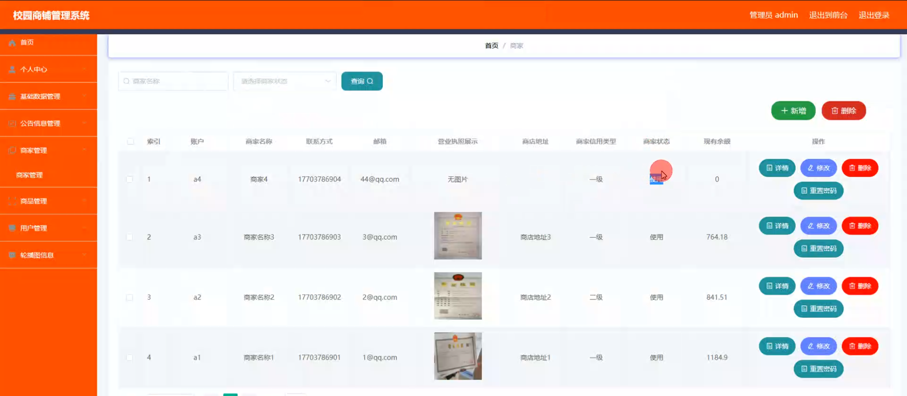
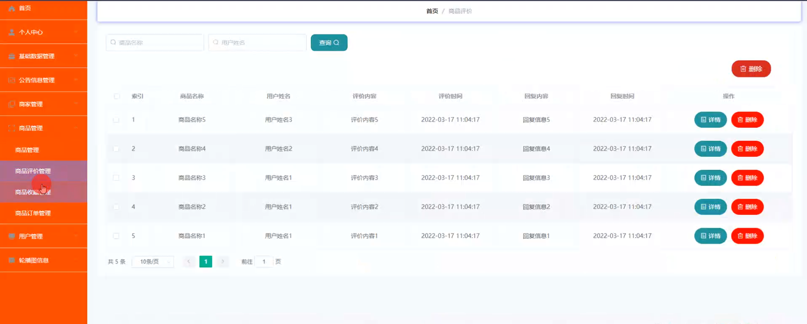
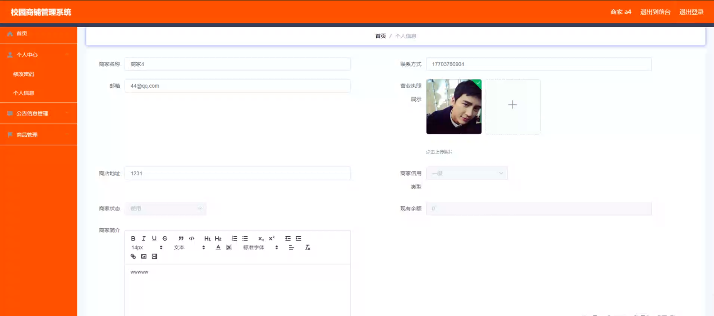
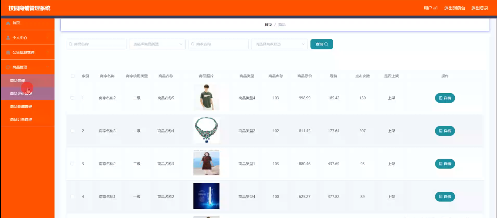

# 基于springboot的校园商铺管理系统

<h4 style='color:red'>联系不到我，就看我的主页 </h4> 
 
#### 介绍

在校园环境中，商铺的运营和管理对于满足师生的日常需求、丰富校园生活具有重要意义。然而，传统的校园商铺管理方式往往存在效率低下、信息不透明、服务质量参差不齐等问题。
本基于 Spring Boot 的校园商铺管理系统旨在为校园商铺的管理提供一个高效、便捷、智能化的解决方案，实现对商铺、商品、用户等信息的集中管理和优化配置，提升校园商铺的服务质量和运营效率。

#### 技术栈

后端技术栈：Springboot+Mysql+Maven

前端技术栈：Vue+Html+Css+Javascript+ElementUI

开发工具：Idea+Vscode+Navicate

#### 系统功能介绍

（一）管理端  
个人中心：管理端人员可以在个人中心查看和修改自己的个人信息，设置工作偏好等。  
基础数据管理  
公告类型管理：对校园商铺相关的公告类型进行分类和定义，如促销活动公告、新品上架公告等。  
商品信用类型管理：设定商品信用的评估标准和类型，如优质、良好、一般等，以规范商品质量。  
商品类型管理：对商品进行分类，如食品、文具、服装等，方便管理和查询。  
公告信息管理：负责发布、编辑和删除校园商铺的各类公告信息，确保信息的准确性和及时性。  
商家管理：  
对入驻校园的商家进行信息登记、资质审核和日常管理。  
处理商家的入驻申请、续约、违规处理等事务。  
商品管理  
商品管理：对校园商铺中的商品进行全面管理，包括商品的上架、下架、库存调整等操作。  
商品评价管理：查看和处理用户对商品的评价，及时了解商品的口碑和质量反馈。  
商品收蠢管理：统计和分析商品的收藏数据，了解热门商品和用户的偏好。  
商品订单管理：处理商品的订单信息，包括订单的确认、发货、退款等操作。  
用户管理：管理校园内的用户信息，包括用户注册审核、用户权限设置等。  
轮播图信息管理：设置校园商铺首页的轮播图内容，用于展示重要的活动、商品或公告。  

（二）商家端  
公告信息：及时获取由管理端发布的公告信息，了解校园商铺的相关政策和活动安排。    
商家：查看和编辑自己店铺的基本信息，如店铺名称、联系方式、营业时间等。  
商品  
商品管理：对自家店铺的商品进行管理，包括添加新商品、修改商品信息、设置商品价格等。  
商品评价管理：回复用户对自家商品的评价，改进商品质量和服务。  
商品收蠢管理：了解用户对自家商品的收藏情况，以便调整商品策略。  
商品订单管理：处理自家店铺商品的订单，安排发货和处理售后问题。  
个人中心：修改个人信息和店铺相关设置。  
后台管理  
公告信息管理：发布自家店铺的促销活动、优惠信息等公告。  
购物车：查看用户添加到购物车中的自家商品，了解用户的购买意向。  

（三）用户端  
公告信息：浏览校园商铺的各类公告，掌握最新的优惠活动和重要通知。  
商家：查找和了解校园内的各个商家信息，方便选择购物。  
商品：  
商品管理：查看校园商铺内的所有商品，进行筛选和比较。  
商品评价管理：对购买的商品进行评价，为其他用户提供参考。  
商品收蠢管理：收藏感兴趣的商品，方便后续购买。  
商品订单管理：查看自己的商品订单状态，进行订单跟踪。  
个人中心：管理个人信息，如收货地址、联系方式等。  
后台管理  
公告信息管理：关注感兴趣的公告信息。  
购物车：将心仪的商品添加到购物车，进行统一结算。  

#### 系统作用

提高管理效率  
实现校园商铺管理的信息化和自动化，减少人工操作和管理成本。  

提升服务质量  
为师生提供更加便捷、优质的购物体验，满足校园内的多样化需求。  

促进公平竞争  
为商家提供公平的竞争环境，通过规范管理和评价机制，激励商家提升服务和商品质量。  

优化资源配置  
合理规划校园商铺的布局和商品种类，提高资源利用效率。  

#### 系统功能截图

代码结构

数据库表

登录

前台页面首页

公告信息模块

商品模块

商家模块

购物车

个人中心

管理员端基础数据管理

商家管理

商品管理

商家端后台管理

用户端后台管理

#### 总结

基于 Spring Boot 的校园商铺管理系统为校园商铺的运营和管理带来了显著的改进。然而，该系统仍存在一些有待完善的地方，例如对于大数据量的处理性能可能需要进一步优化，系统的安全性防护还需要不断加强，以应对日益复杂的网络环境。此外，系统在与校园其他信息系统的集成方面还有提升空间，以实现更全面的校园服务一体化。未来，我们将持续改进和完善系统，不断适应校园商铺管理的新需求和新变化，为校园商业的繁荣发展提供更有力的支持。

#### 使用说明

创建数据库，执行数据库脚本 修改jdbc数据库连接参数 下载安装maven依赖jar 启动idea中的springboot项目

前台登录页面
http://localhost:8080/xiaoyuanshangpuguanli/front/index.html

后台登录页面
http://localhost:8080/xiaoyuanshangpuguanli/admin/dist/index.html

管理员				账户:admin 		密码：admin

商家				账户:a1 		密码：123456

用户				账户:a1 		密码：123456